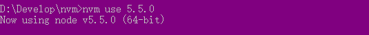

# 配置Node环境步骤

> 适用于Windows，Linux下配置非常简单，几条命令行就搞定，后面有空了可以做个文档

- 1.<a href='#nvm'>NVM</a> -- 用于NodeJS版本切换 
- 2.<a href='#npm'>NPM</a> -- NodeJS包管理工具(还有bower,n他们的使用方式都差不多，就不介绍了，毕竟NPM是主流)
- 3.<a href='#nrm'>NRM</a> -- 切换NPM源

<i id='nvm'></i>
## 什么是NVM
NVM(Node Version Manager)是Node.js的一个版本管理工具，可以切换不同版本的Node.js，非常方便。

### 安装NVM
- 下载并安装在全英文路径下：[下载NVM](https://github.com/coreybutler/nvm-windows/releases)


---
- 选择安装路径（全英文路径）


---
 
- 选择切换node的路径（也要全英文）


---
  
> 安装成功后，打开 `cmd`，输入：`nvm –v` 查看nvm版本，如果显示一下信息说明安装成功。


 
### 安装Node.js
> 在nvm安装安装目录下安住shift+鼠标右键，在弹出的框中选“`在此次打开命令行窗口`”；  
输入命令: ```nvm inatall 5.5.0``` ，后面的5.5.0是安装nodejs的版本号。
安装成功后，提示一下信息：


---
 
> 输入命令： `nvm ls` ，可以查看当前安装的node.js的版本。


---
 
> 安装文件下也多出了安装的nodejs版本文件夹。


---

### 启动Node.js

> 使用命令启动或切换nodejs版本：`nvm use 5.5.0` ，后面的数字是启动nodejs的版本号（启动的nodejs版本必须是安装成功的nodejs版本），启动成功后，显示如下信息：



---
 
> 然后可以通过 node –v ，查看当前启动的nodejs的版本


---

### 统一管理npm包

> 在切换nodejs版本的时候npm包是无法切换的，这时我们可以通过配置环境变量的方式统一管理npm包，这样在切换不同版本的时候也可以统一调用同一个npm包。   
> 因为程序在运行的时候是先找程序本身下的依赖环境，如果找不到就会在环境变量下配置的路径中去寻找。
#### 在nvm目录中新建一个文件夹命名为 `npm` （可随意取名）


---
 
#### 改变系统默认npm包下载的路径
> 默认路径是：C:\Users\ [你的计算机名]\AppData\Roaming，可以通过命令：   
`npm config get prefix`，查看当前系统npm路径  
下面有两个文件夹`npm`和`npm-cache`文件夹，npm就是存储下载的包，我可以通过修改保存路径来实现统一管理，方法如下：(在cmd中输入一下命名)    
`npm路径：`npm config set prefix "D:\Develop\nvm\npm" `  
npm-cache路径：`npm config set cache "D:\Develop\nvm\npm-cache"`

### 配置npm环境变量：

- 新建一个用户变量

> 变量名：`NPM_HOME`  
> 变量值：`D:\Develop\nvm\npm`（自己安装的路径）

- 保存后在设置用户path路径

> `;%NPM_HOME%`

保存并退出。
在命令行可以通过`set`命令查看是否设置成功


---

<i id='npm'></i>
## NPM基本使用 [官方文档](https://docs.npmjs.com/)

#### 初始化
> 每次在使用一个新的路径的时候，如果要用npm命令安装包，首先需要cd到当前目录，在使用命令：    
> `npm init`   
> 初始化目录，一路回车，并将在工程根目录下生成一个`package.json`这样一个文件。   

#### 包安装
> CMD命令：   
> `npm install [包名] -g -–save`   
> 将生成一个node_modules的文件夹，里面就是下载的包。 


> 安装依赖问题：  
> -g表示全局安装的意思（global）
> `--save-dev`:开发依赖，项目后期不用就不用项目依赖  
> `--save`:项目依赖，项目后期部署如果要用就项目依赖

`如果在项目中已有package.json文件，可以使用命令：npm install，将下载项目所依赖的包，package.json里面可以配置很多有趣的东西`, [建议参考官方文档](https://docs.npmjs.com/files/package.json)

<i id='nrm'></i>
## NRM

> 用于切换NPM的各个节点，`建议使用官方的节点，有些东西下载不了`  
> 安装: `npm install nrm -g`

- 查看是否安装成功 输入命令：`nrm --version` 如下图：


---

### NRM基本使用

#### 查看所有节点
> 命令：`nrm ls` 


- 图中 `*` 表示当前正在使用的节点

---

#### 切换节点

> 命令： `nrm use [节点名称]`   
> 如上图的taobao、cnpm
 
[![NPM version][npm-image]][npm-url] 
[npm-image]: https://img.shields.io/npm/v/nrm.svg?style=flat-square
[npm-url]: https://npmjs.org/package/nrm 


