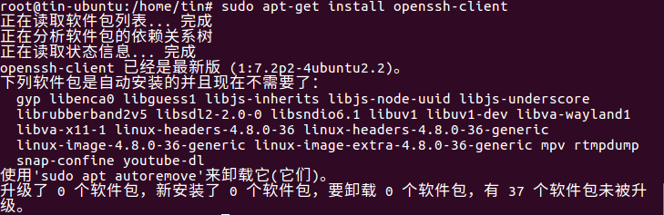
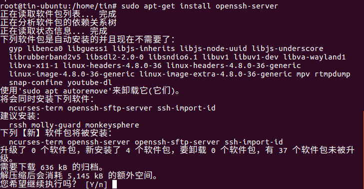

# Ubuntu下开启SSH登录功能

### 判断是否安装ssh服务：

```shell
ps –e|grep ssh
```


### 安装ssh-client

```shell
sudo apt-get install openssh-client
```


### 安装ssh-server

```shell
sudo apt-get install openssh-server
```



> 此处选择Y继续安装

### 启动服务

```shell
sudo /etc/init.d/ssh start
```


### SSH服务默认的端口是22，可以修改

```shell
sudo gedit /etc/ssh/sshd_config  
```
> gedit命令只能在可视化界面使用,通过ssh连接可以使用vim


### 修改后重启

```shell
sudo /etc/init.d/ssh restart
```

# END

